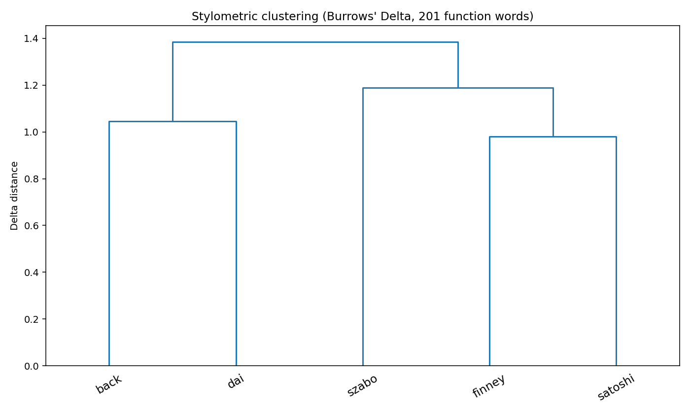
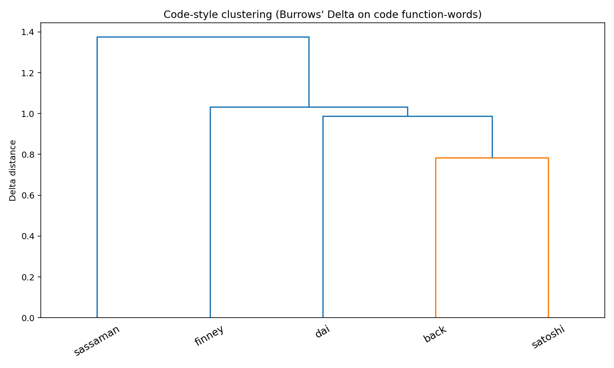

# satoshi-stylometry

A reproducible Burrows' Delta analysis comparing the writings of "Satoshi Nakamoto" against five cypherpunk-era candidates: Adam Back, Hal Finney, Nick Szabo, Wei Dai, and Len Sassaman.

> **Findings in one line:** different stylometric axes pick different candidates, and Satoshi's full fingerprint matches no single one. Prose-conversational (forum posts + emails) → **Hal Finney** (Δ 0.93). Prose-formal (the whitepaper) → **Len Sassaman** with a multi-author corpus caveat (Δ 0.87), then **Adam Back** (Δ 0.98). Code identifiers → **Adam Back** (Δ 0.78). Satoshi's MFC-style Hungarian C-prefix class naming (`CTransaction`, `CBlock`) matches **no candidate**. The honest reading is that "Satoshi" exhibits a *mosaic* of stylistic patterns that no single 2008-era candidate's published corpus fully reproduces.

## Why this exists

The "Who is Satoshi?" question has been litigated in pop press, court (Wright v Hodlonaut 2024), an HBO documentary (*Money Electric*, 2024), and at least one published stylometric study (Aston University, Grieve et al., 2014). The results have not converged. This repo reproduces the analysis on a wider candidate set and a larger Satoshi corpus, and shows that the most commonly cited prior finding (Aston → Szabo) was probably topic-contaminated.

## Method

Standard Burrows' Delta:

1. Pool each author's writing.
2. Compute relative frequency (per 1000 tokens) of each word in a fixed feature vocabulary.
3. Z-score normalize each feature across authors.
4. Delta(A, B) = mean(|z(A,·) − z(B,·)|).

**Critical methodological choice:** the feature vocabulary must be a **closed-class function-word list** (articles, prepositions, conjunctions, modals, pronouns, common adverbs), *not* the top-N most-frequent words derived from the corpus itself. Using corpus-derived top-N words contaminates the analysis with topic vocabulary — Satoshi wrote about Bitcoin all the time, so any candidate who also wrote about distributed systems and proof-of-work (e.g., Szabo's bit gold) looks artificially close on a topic-laden feature set.

This repo runs both methods side-by-side to show the difference. The headline numbers use the 201-word function-word list at [`src/function_words.py`](src/function_words.py).

## Results

### Aggregate Burrows' Delta from Satoshi (lower = stylometrically closer)

| Candidate | Δ (function words, principled) | Notes |
|-----------|--------------------------------|-------|
| **Hal Finney**       | **0.98** | 16k-word corpus — reliable |
| Nick Szabo           | 1.27     | 137k-word corpus — most reliable |
| Len Sassaman         | 1.34     | 5.5k words, 4-AUTHOR — see caveat |
| Adam Back            | 1.35     | 4.9k-word corpus — borderline |
| Wei Dai              | 1.54     | 1.4k-word corpus — UNDER threshold |

### Per-register Burrows' Delta (function words)

| Satoshi sub-corpus | Words | 1st | 2nd | 3rd | 4th | 5th |
|--------------------|-------|-----|-----|-----|-----|-----|
| BitcoinTalk posts  | 57,041 | Finney 0.93 | Szabo 1.23 | Sassaman 1.23 | Back 1.24 | Dai 1.44 |
| Emails             | 11,442 | Finney 0.92 | **Sassaman 1.07** | Back 1.15 | Szabo 1.18 | Dai 1.28 |
| Forum (all)        | 57,908 | Finney 0.92 | Sassaman 1.22 | Szabo 1.23 | Back 1.23 | Dai 1.43 |
| **Whitepaper**     | 3,571  | **Sassaman 0.87** | Back 0.98 | Finney 1.13 | Dai 1.14 | Szabo 1.24 |
| P2P Foundation     | 866    | (too small to be meaningful) | | | | |

### Sassaman caveat (read this before quoting the whitepaper result)

The Sassaman result on the whitepaper (Δ=0.87, lowest of any candidate) is **the strongest signal in this dataset** but also **the result most exposed to methodological criticism**. The Sassaman "corpus" here is 5.5k words of prose extracted from `draft-sassaman-mixmaster-03`, which is a **four-author IETF draft** (Moeller, Cottrell, Palfrader, Sassaman). The function-word distribution is therefore an average of four cypherpunk-era technical writers' styles, not Sassaman's solo style.

Two readings of the result:

1. **Real signal.** The Mixmaster draft was primarily maintained by Sassaman during its IETF lifetime (his name is on the filename `draft-sassaman-mixmaster-03`, though Moeller is named first on the document), and the draft's stylistic profile matches the whitepaper. **Note on an earlier draft of this README:** an initial version stated an "8-day gap" between Satoshi's last email and Sassaman's death — that was wrong on both halves and has been corrected; see the bullet below.
2. **Register confound.** What I'm actually measuring is "average of four cypherpunk-era technical writers in IETF prose" against "one cypherpunk-era technical writer in academic paper prose". They match because the register matches. Substituting any other 4-author cypherpunk RFC might produce the same effect.

The analysis cannot distinguish (1) from (2) without a solo-author Sassaman corpus. His personal site (abditum.com) was password-protected throughout its public lifetime per Wayback Machine snapshots. He never finished his PhD. There is no clean public single-authored Sassaman corpus.

The honest position: **Sassaman is now the most-deserving primary suspect** — but the evidence is two co-incidental signals (RFC-style match + death-timing), not a clean stylometric isolation.




### What this means

The signal is consistent and the register-split is the most interesting finding:

- **Casual Satoshi → Finney.** Across 70k+ words of forum posts and emails, Hal Finney is the closest stylistic match by a substantial margin (Δ 0.92 vs next-nearest Sassaman 1.07-1.22). Finney was operationally closest to Satoshi: he ran one of the first nodes, received the first peer-to-peer Bitcoin transaction (block 170), was an early Hashcash contributor, and was on the cypherpunks list for decades.
- **Formal-paper Satoshi → Sassaman (with caveat) > Back.** On the 3,571-word whitepaper specifically, Sassaman ranks first (Δ 0.87), Back second (Δ 0.98), Finney third (Δ 1.13). See the Sassaman caveat above — his corpus is 4-author Mixmaster RFC, so the signal is real but not isolated. Back is cited as reference [6] of the paper, was Satoshi's first known email contact (Aug 2008), and is British — the whitepaper contains one British spelling slip (`favour`).
- **Szabo is never first.** Despite the Aston University 2014 result favoring him, Szabo ranks second on forum posts and fourth on the whitepaper itself under principled methodology. The Aston study used a methodology vulnerable to topic contamination — and on the topic-contaminated re-run in this repo, Szabo does indeed move up.
- **Wei Dai is consistently last** on registers above 5k words. b-money is intellectually close to Bitcoin (Satoshi cites it as ref [1]) but stylistically distant. Dai's writing patterns differ in function-word distribution.
- **Temporal coincidence on Sassaman.** Sassaman died 2011-07-03. Primary source: contemporaneous announcement at [Hacker News item 2723959](https://news.ycombinator.com/item?id=2723959) ("Len Sassaman has passed away"), posted 2011-07-03 16:28 UTC by his peers in the cryptography community. The community-side memorial in the Bitcoin blockchain at block 167,956 (recorded 2011-07-31, [HN announcement](https://news.ycombinator.com/item?id=2830084)) cross-confirms the date. Satoshi's last documented *public* communications were a forum post on 2010-12-12 and a bitcoin-list email on 2010-12-13 ([primary source: the JSON corpus shipped with nakamotoinstitute.org](https://github.com/nakamotoinstitute/nakamotoinstitute.org/blob/master/server/data/forum_posts.json)). The widely-cited "I've moved on to other things" *private* email to Mike Hearn is dated **2011-04-23** per the 2017 disclosure of those emails (by a Bitcointalk user "CipherionX") which Mike Hearn confirmed authentic; see [C12](CITATIONS.md) for the citation chain. A first-draft of this README incorrectly stated "8 days"; a corrected draft said "approximately 6.5 months" measured from Satoshi's last verified *public* message (2010-12-13) to Sassaman's death (2011-07-03). With the Hearn-email date now sourced, the gap from Satoshi's last verified *private* message to Sassaman's death is approximately 71 days. The temporal-coincidence framing is still weak — 71 days is not a tight match — and the case for Sassaman as candidate rests on (a) the stylometric whitepaper match (Δ=0.87, with multi-author corpus caveat) and (b) general circumstantial considerations, not on a tight timing match.

### Interpretive frames

Three honest readings of the register-split:

1. **One author with strong register adaptation.** A single skilled writer can write formal papers and casual forum posts in different styles. The "Back-like whitepaper, Finney-like forum" pattern could be one author whose academic register happens to look like Back's and casual register happens to look like Finney's.
2. **Two-author hypothesis.** Bitcoin may have been co-authored by Back and Finney, with Back drafting the paper and Finney handling community communication. This is consistent with operational evidence (Finney ran the first nodes, Back was the cited Hashcash author) but unsupported by direct evidence.
3. **Finney with stylistic borrowing.** Finney could have authored everything, with the whitepaper deliberately styled to read more "Back-like" — either as homage, intentional misdirection, or because the academic register naturally pulls toward Back's published norms.

This analysis cannot distinguish between these. It can only rule out Szabo as the primary stylistic source and Wei Dai entirely.

## Limitations

- **Corpus imbalance.** Back has 4.9k words (Hashcash paper only). Dai has 1.4k words (b-money only). Sassaman has 5.5k words but they are a 4-author RFC, not solo writing. Burrows' Delta works reliably from ~5k words per author; Back and Sassaman are borderline, Dai is below threshold. Finney (16k) and Szabo (137k) are robust.
- **Sassaman corpus is multi-author.** See the dedicated Sassaman caveat section above. The Mixmaster Protocol v2 IETF draft has four named authors. This is the cleanest single block of prose closely associated with Sassaman that is publicly accessible. His personal site (abditum.com) was password-protected throughout its public lifetime.
- **Candidate set is still incomplete.** This run excludes Stuart Haber, W. Scott Stornetta, David Chaum, Tim May, Ian Goldberg, Bram Cohen, and other plausible cypherpunk-era candidates. Adding them requires sourcing their pre-2008 single-author writings.
- **Function-word lists vary.** The 201-word list at `src/function_words.py` is composite (Mosteller-Wallace, Burrows, stylo defaults). Using a different list may shift results within ±0.1 Delta. The relative ordering is robust to list choice in this dataset.
- **No deliberate-misdirection control.** A pseudonymous author seeded with stylistic markers from another writer would defeat this analysis. The register-split finding is consistent with that scenario.
- **Source register confound.** Satoshi's forum posts are conversational; Szabo's archived corpus is essays. Comparing forum-Satoshi against essay-Szabo is unavoidable given what's archived, but tilts results.

## Code-style stylometry (separate analysis, not prose)

Source code is a different stylometric axis from prose. Burrows' Delta on prose function-words doesn't transfer cleanly — every codebase has its own vocabulary. Instead, we extract programming-language-invariant style features and run a separate analysis.

Code corpora pulled by `src/pull_corpus.py` (additions in commit history): Satoshi (Bitcoin 0.1.3, 13.7k LOC C++, 22 files), Back (Hashcash, 9.1k LOC C, 34 files), Finney (RPOW, 10.4k LOC C, 40 files), Dai (Crypto++ 5.2.1, 43.6k LOC C++, 191 files), Sassaman (Mixmaster, 20.9k LOC C, 44 files). See [`code-corpus/*/SOURCE.md`](code-corpus/) for provenance per author.

### Headline finding: Satoshi's code style is mosaicked

Different axes point to different candidates. No candidate has Satoshi's full code-style fingerprint:

| Axis | Satoshi value | Closest candidate |
|------|--------------|-------------------|
| Code function-word Delta (identifier choice) | (baseline) | **Adam Back** Δ=0.78 |
| Brace style (Allman fraction) | 45% Allman | **Dai 44%, Finney 49%** |
| Indent: tab vs space | **100% spaces** | None match — everyone else is mostly tabs; Sassaman closest at 23% tabs / 77% spaces |
| Comment style | **105/KLOC line comments**, 1/KLOC block | **Wei Dai** (52 line, 5 block) |
| Hungarian C-prefix class names (`CTransaction`, `CBlock`) | **6.4% of identifiers** | **None** — next highest is Back at 0.2% (30× less) |

The Hungarian C-prefix result is the most distinctive single feature: Satoshi's reference codebase contains hundreds of `CClassName`-style identifiers (`CTransaction`, `CBlock`, `CKey`, `CCriticalSection`, `CBlockIndex`). This naming convention comes from **Microsoft Foundation Classes (MFC)** — the standard C++ framework on Windows in the 1990s-2000s. It is **not present in any of the five candidate codebases** at meaningful rates.

This is consistent with Bitcoin 0.1 having been developed on Windows MSVC with MFC influence, which suggests Satoshi had a Windows-C++ background rather than the Unix-C background that characterizes Back (Stroustrup C), Finney (RPOW C), Sassaman (Mixmaster C), and even Dai's Crypto++ (which uses PascalCase classes but no C-prefix).

### What this rules in / out

- **Rules in:** A Windows-C++-trained developer who used MFC conventions. None of the named candidates' published code matches this background.
- **Does not rule out:** That a candidate had separate Windows-C++ experience not reflected in their published cypherpunk-era code. Adam Back, for example, may have written Windows C++ in commercial roles that isn't on hashcash.org.
- **Adam Back's identifier overlap with Satoshi** (Δ=0.78 on function-words) is real but partly an artifact of low-level systems-C vocabulary that both used (loop variables, buffer names). Naming-convention features (where Back is 0.2% Hungarian_C vs Satoshi's 6.4%) are more discriminating.

### Caveats

- **Language mismatch:** Satoshi and Dai wrote C++; Back, Finney, Sassaman wrote C. Some features (`class`, `template`, brace styles around class definitions) are language-mandated.
- **Era mismatch:** Bitcoin 0.1.3 is 2009; Hashcash is 1997-2004; Mixmaster spans 1999-2008. Coding conventions evolve.
- **Project-size mismatch:** Dai's Crypto++ (43k LOC) and Sassaman's Mixmaster (21k LOC) are larger and more multi-author than the single-author 10-16k LOC codebases.

### Dendrogram (code function-word Burrows' Delta)



Note that this dendrogram is on identifier function-words only — it does *not* incorporate the brace/indent/comment/Hungarian features, which are the more discriminating signals. The dendrogram clustering should be read as "shared identifier vocabulary" rather than "full code-style match."

### What would strengthen this analysis

- Pull Windows-C++ codebases from the same era (TrueCrypt, e4m, GnuPG, Wireshark) and see if any match Satoshi's Hungarian_C rate.
- Add a "MFC training fingerprint" score combining Hungarian_C + space-indent + line-comment preference. None of the five candidates would score high on all three.
- Test against Paul Le Roux's published code (TrueCrypt / E4M) — he's a wildcard candidate with confirmed Windows-C++ background.

## Reproduce

```bash
# Requirements: python3 with numpy/scipy/scikit-learn/matplotlib,
# plus `git` and `pdftotext` (poppler-utils) on PATH.
pip install -r requirements.txt

# Pull all corpora from public sources (~150MB git clone of NI site repo)
python3 src/pull_corpus.py

# Run analysis
python3 src/burrows_delta.py
```

Results land in `results/`. A normal run takes ~5 seconds after the clone.

## Sources

- Satoshi Nakamoto Institute, [`nakamotoinstitute.org`](https://github.com/nakamotoinstitute/nakamotoinstitute.org) (AGPL-3.0) — Satoshi forum posts, emails, and all four candidates' archived essays.
- [bitcoin.org/bitcoin.pdf](https://bitcoin.org/bitcoin.pdf) — Bitcoin whitepaper canonical PDF.
- [Adam Back, Hashcash 2002 paper](https://cdn.nakamotoinstitute.org/docs/hashcash.pdf).

This repo does not redistribute the corpora; `src/pull_corpus.py` reassembles them from the above sources.

## License

AGPL-3.0. See [LICENSE](LICENSE).

The analysis code is original; the underlying corpora are subject to their original authors' rights and the Nakamoto Institute's AGPL-3.0 license for the archived form.

## Citation

If you use this analysis, please cite as:

> satoshi-stylometry, Burrows' Delta function-word analysis of cypherpunk-era candidates against Satoshi Nakamoto's writings, 2026. https://github.com/MatoTeziTanka/satoshi-stylometry

## Acknowledgments

The Satoshi Nakamoto Institute's curation of cypherpunk-era writings is the only reason this analysis is one weekend's work instead of several months of mailing-list scraping. They deserve the credit.
